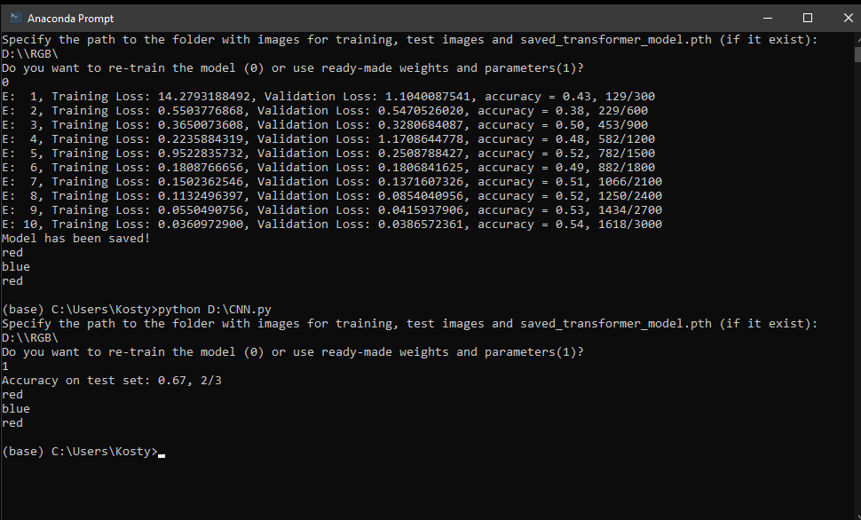

Проект: Использование нейросети архитектуры трансформер для классификации изображений

Выполнил: Ворон Константин Викторович, студент МАИ, группа М80-205Б-23

Инструкция по установке

1.	Убедитесь, что у вас установлен Python версии 3.11 (С этой версией стабильно работает Pytorch).  
2.	 CUDA (Необязательно, но желательно):
Если планируется использовать GPU-ускорение (что сильно рекомендуется для работы с PyTorch), вам потребуется CUDA
Toolkit версии 12.6. Скачайте и установите его с сайта NVIDIA, выбрав подходящую версию для вашей операционной системы и
видеокарты.  Инструкции по установке можно найти на сайте NVIDIA. Обратите внимание на соответствие версии CUDA и
драйверов видеокарты.

4.	 Установка пакетов Python:
После установки Python и (при необходимости) CUDA, клонируте репозиторий и установите необходимые библиотеки
с помощь следующего кода:

	git clone https://github.com/Grimm222/PyCNN
	pip install -r requirements.txt

Эта команда установит все необходимые библиотеки.

Инструкция по использованию
1.	 Подготовка данных: Скачайте файл CNN.py из репозитория. Скачайте архив RGB.zip с Яндекс.Диска(https://disk.yandex.ru/d/a--41BXV54K3ZQ). Распакуйте архив.
2.	Запуск программы: запустите код CNN.py через консоль. Программа попросит указать путь к папке. Введите путь к папке RGB в формате «…\RGB\». Программа спросит, хотите ли вы переобучить модель (0) или использовать предварительно обученную (1).

•	Вариант 0 (Переобучение): Программа начнёт процесс обучения модели. В процессе обучения будут выводиться промежуточные результаты (потери на обучающем и валидационном наборах, точность). После завершения обучения модель будет сохранена в файл saved_transformer_model.pth по указанному адресу.

•	Вариант 1 (Использование готовой модели, работает только при предварительном обучении): Программа загрузит веса модели из файла saved_transformer_model.pth и сразу начнёт тестирование на тестовом наборе данных. Результаты тестирования (точность) будут выведены на консоль.

3.	После обучения (или загрузки обученной модели), программа выполнит классификацию трёх изображений. (при использовании набора изображений из папки RGB нейросеть научится определять, какого цвета на изображении больше: красного, зелёного или синего).

Пример вызова программы через консоль для переобучения и классификации изображений

